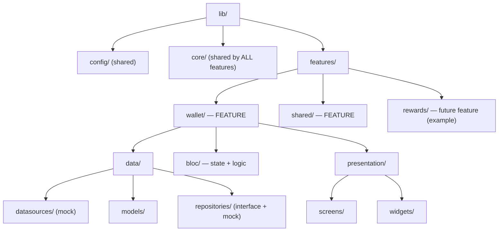

# Folder Structure & Architecture

> **Visual board (Miro):** https://miro.com/app/board/uXjVHFcyqb4=/
> — feature-based folder diagram, a layer-based contrast diagram, and this rationale.

This project is organized **by feature, not by technical layer**. The result is a
**hybrid**: *feature-first on the outside, clean-architecture layers on the inside.*

---

## Feature-based structure (chosen)

Each folder under `lib/features/` owns a full vertical slice. Shared, cross-cutting code
lives once in `core/` and `config/`.

```
lib/
├── main.dart · app.dart            # entry
├── config/                         # ── shared ──
│   ├── routes/                     # go_router
│   └── themes/                     # light + dark
├── core/                           # ── shared by ALL features ──
│   ├── di/                         # injectable
│   ├── network/                    # dio
│   ├── errors/                     # Failure
│   ├── environment/ · models/
│   ├── utils/                      # validators
│   └── presentation/               # shared widgets
├── features/
│   ├── wallet/                     # ◀ a FEATURE — self-contained, liftable
│   │   ├── data/
│   │   │   ├── datasources/        # mock data
│   │   │   ├── models/
│   │   │   └── repositories/       # interface + mock impl
│   │   ├── bloc/                   # state + logic
│   │   └── presentation/
│   │       ├── screens/            # wallet, transfer
│   │       └── widgets/
│   ├── shared/                     # a FEATURE (locale/theme)
│   └── rewards/                    # ◀ future feature drops in here, untouched by others
├── l10n/
└── generated/
```



---

## Feature-based vs. layer-based

| Aspect | Feature-based (chosen) | Layer-based |
| --- | --- | --- |
| Grouping | by feature (`wallet/`, `rewards/`) | by layer (`data/`, `domain/`, `presentation/`) |
| A feature's files | live together in one folder | scattered across every layer folder |
| Find / change a feature | open one folder | hop between 3+ folders |
| Reuse in another project | copy one folder | untangle it from shared layers |
| When a feature grows large | only its own folder grows | bloats the global layer folders |
| Deleting a feature | delete one folder | hunt files across layers |
| Merge conflicts | isolated per feature | concentrated in shared layers |
| Best fit | apps that grow, many features, teams | tiny single-feature apps / demos |

A layer-based tree splits a single feature across every layer folder:

```
lib/
├── data/           # wallet + rewards + profile models & repos (mixed)
├── domain/         # wallet + rewards + profile logic (mixed)
└── presentation/   # wallet + rewards + profile screens (mixed)
```

---

## Why feature-based here (rationale)

- **Cleaner & more readable** — high cohesion, low coupling. Everything about a feature is
  in one place, so you read and reason about it without jumping around the tree.
- **Reusable & liftable** — a feature is self-contained, so moving a single feature into
  another project is mostly a copy of one folder (its only outside dependency is `core/`).
  The same boundary later makes it trivial to promote a feature into its own package.
- **Scales without side effects** — when a feature gets big and its files multiply, the
  growth stays inside that feature's folder. Other features are untouched, so size never
  turns into cross-feature risk.

### Extra benefits

- **Team ownership & fewer conflicts** — teams own whole features; work happens in separate
  folders, so merges rarely collide. Maps cleanly to `CODEOWNERS`.
- **Deletability** — removing a feature is deleting one folder; no dead code stranded in
  shared layers.
- **Enforceable boundaries** — features should not import each other's internals; anything
  shared is promoted to `core/`. This rule is easy to keep (and even lint).
- **A path to a modular monorepo** — feature folders are the natural stepping stone to
  per-feature packages (e.g. Melos) with explicit dependencies.

---

## Conventions that keep it clean

1. **No feature → feature imports.** Communicate via routing or shared abstractions in `core/`.
2. **Shared code goes to `core/` / `config/`** — never duplicated inside features.
3. **Every feature mirrors the same internal layers** (`data` / `bloc` / `presentation`).
4. **Trade-off:** for a 2-screen demo this adds a few extra folders, but it pays for itself
   the moment a second feature or a second developer appears.
